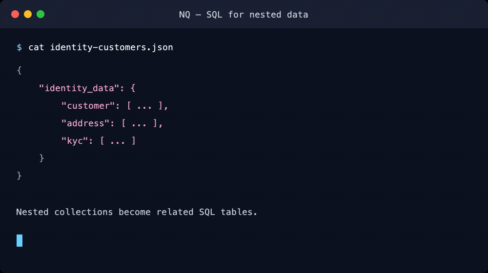

# NQ — SQL for nested data

[](https://github.com/blater/nq/actions/workflows/ci.yml)
[](https://github.com/blater/nq/releases/latest)
[](LICENSE.txt)

Use SQL to query and reshape JSON, YAML, XML, CSV, JSON Lines, and Parquet,
turn joined rows into deliberate output hierarchies, and move hierarchical
data into or out of relational databases.

## Install

### macOS ARM64

```bash
brew install blater/tap/nq
```

### Linux x64

```bash
NQ_VERSION=0.9.3
curl -fLO "https://github.com/blater/nq/releases/download/v${NQ_VERSION}/nq-${NQ_VERSION}-linux-x64.tar.gz"
curl -fLO "https://github.com/blater/nq/releases/download/v${NQ_VERSION}/SHA256SUMS"
grep "nq-${NQ_VERSION}-linux-x64.tar.gz" SHA256SUMS | sha256sum --check
tar -xzf "nq-${NQ_VERSION}-linux-x64.tar.gz"
install -m 0755 nq "$HOME/.local/bin/nq"
nq --help
```

### Windows x64

```powershell
$version = "0.9.3"
$asset = "nq-$version-windows-x64.zip"
$release = "https://github.com/blater/nq/releases/download/v$version"
Invoke-WebRequest "$release/$asset" -OutFile $asset
Invoke-WebRequest "$release/SHA256SUMS" -OutFile SHA256SUMS
$expected = ((Select-String $asset SHA256SUMS).Line -split '\s+')[0].ToLower()
$actual = (Get-FileHash $asset -Algorithm SHA256).Hash.ToLower()
if ($actual -ne $expected) { throw "Checksum verification failed" }
Expand-Archive $asset -DestinationPath .\nq
.\nq\nq.exe --help
```

See the [complete installation guide](docs/install.md) for the JVM build,
supported platforms, included JDBC drivers, checksum verification, and
operating-system security prompts.

## Your first query

Pipe JSON straight into an ordinary SQL query. Use `-i` (or `--input`) because
standard input has no filename extension from which to infer its format:

```bash
echo '{
  "users": [
    {"name": "Alice", "active": true},
    {"name": "Bob", "active": false},
    {"name": "Charlie", "active": true}
  ]
}' | nq -i json "select name from users where active = 'true' order by id;"
```

```json
[{"name":"Alice"},{"name":"Charlie"}]
```

NQ discovers the `users` collection as a table. Shell redirection is equivalent
to a pipe:

```bash
nq -i json "select name from users where active = 'true' order by id;" < myusers.json
```

Add `--cache` to either command when the input should remain available as nq's
active cache. The cache is keyed by the input type and content hash, so
replaying the same stream reuses it safely.

## The distinctive part: turn joined rows into a hierarchy

A customer/order/item join repeats customer and order values across its flat
rows. NQ maps selected values into an output hierarchy, while identity keys say
which rows contribute to the same customer, order, and item:

```sql
select
  c.id into {customers.customer.id},
  c.name into {customers.customer.name},
  o.id into {customers.customer.orders.order.id},
  o.ordered_on into {customers.customer.orders.order.orderedOn},
  i.sku into {customers.customer.orders.order.items.item.sku},
  i.quantity into {customers.customer.orders.order.items.item.quantity}
from customer c
join customer_order o on o.customer_id = c.id
join order_item i on i.order_id = o.id
order by c.id, o.id, i.id
structure
  {customers.customer} key (c.id),
  {customers.customer.orders.order} key (c.id, o.id),
  {customers.customer.orders.order.items.item} key (c.id, o.id, i.id);
```

Run the self-contained, tested recipe from a repository clone:

```bash
nq docs/recipes/database-to-nested-json/database-to-nested-json.nq \
  --db h2 --database mem:nq_database_to_nested
```

```json
{
  "customers": {
    "customer": [
      {
        "id": "1",
        "name": "Alice",
        "orders": {
          "order": [
            {
              "id": "1001",
              "orderedOn": "2026-07-01",
              "items": {
                "item": [
                  {
                    "sku": "TEA",
                    "quantity": "2"
                  },
                  {
                    "sku": "CAKE",
                    "quantity": "1"
                  }
                ]
              }
            },
            {
              "id": "1002",
              "orderedOn": "2026-07-15",
              "items": {
                "item": {
                  "sku": "MUG",
                  "quantity": "2"
                }
              }
            }
          ]
        }
      },
      {
        "id": "2",
        "name": "Bob",
        "orders": {
          "order": {
            "id": "1003",
            "orderedOn": "2026-07-20",
            "items": {
              "item": {
                "sku": "COFFEE",
                "quantity": "1"
              }
            }
          }
        }
      }
    ]
  }
}
```

The keys prevent join expansion from duplicating parent objects. The same
mapping works when the rows come from a configured JDBC database, and
`--output yaml` or `--output xml` changes the boundary format without changing
the query.

## Query related collections inside a nested file

NQ also discovers related collections inside a document as tables. It can join
and aggregate them before mapping the result into a different hierarchy:



```bash
nq docs/examples/identity-country-counts.nq docs/examples/identity-customers.json
```

```json
{"result":{"region":[{"country":"GB","customerCount":"2"},{"country":"US","customerCount":"4"}]}}
```

The same script works with the equivalent
[`identity-customers.yaml`](docs/examples/identity-customers.yaml) and
[`identity-customers.xml`](docs/examples/identity-customers.xml) fixtures.

## When should I use NQ?

Use NQ when:

- a nested API response, export, or fixture needs a relational query;
- joined SQL rows must become deliberately structured JSON, YAML, or XML
  without duplicated parent objects;
- JSON, YAML, XML, CSV, JSON Lines, or Parquet must drive database inserts,
  updates, deletes, or stored-procedure calls; or
- a repeatable data-movement task is clearer as a small SQL-like script than
  as application code.

Use a more focused tool when the task is simpler: jq for JSON-native filters,
yq or Dasel for direct document edits, Remarshal for guarded format
conversion, Miller for record-stream processing, or DuckDB and other
SQL-over-file tools for primarily analytical or tabular queries. The
[comparison guide](docs/comparison.md) describes the boundaries without trying
to make NQ the answer to every data task.

## Three core workflows

### Query a nested file

NQ materializes discovered collections into a temporary local H2 database and
runs the SQL. No external database or service is involved.

```sql
select
  a.country_code as country_key,
  a.country_code into {result.region.country},
  count(distinct c.id) into {result.region.customerCount}
from customer c
join address a on a.customer_id = c.id
join kyc k on k.customer_id = c.id
where a.kind = 'residential' and k.status <> 'not_started'
group by a.country_code
order by country_key
structure {result.region} key (country_key);
```

### Extract a hierarchy from a database

The runnable H2 example in
[`docs/recipes/database-to-nested-json`](docs/recipes/database-to-nested-json/README.md)
maps joined customer, order, and item rows directly into nested JSON. Use
`--output yaml` or `--output xml` to change the boundary format.

### Apply a hierarchical file to a database

The runnable H2 example in
[`docs/recipes/json-to-database`](docs/recipes/json-to-database/README.md) uses
paths such as `{message.person.id}` in mapped `insert` and `update` statements.
Equivalent YAML and XML structures use the same neutral hierarchy model.

Browse the [task-oriented recipe index](docs/recipes/README.md) for more.

## Files, caches, and output

Supported input extensions are `.json`, `.jsonl`, `.yaml`, `.yml`, `.xml`,
`.csv`, and `.parquet`. Parquet support is production-supported within the
[documented limitations](docs/user-manual.md#parquet-input).

An input file supplied by itself is converted directly to JSON by default, or
to the format selected by `--output`, without creating an H2 database:

```bash
nq customers.xml --output json
nq customers.json -o yaml
nq customers.csv --output markdown
```

An input file supplied with a query uses a fresh temporary H2 database. Add
`--cache` or `-c` explicitly to create and activate a persistent local cache:

```bash
nq --cache customers.json
nq catalog
nq "select id, name from customers order by id;"
nq --list-caches
```

The default cache directory is `~/.nq/cache`. NQ does not upload source data or
send usage telemetry.

Output defaults to JSON. Choose JSON Lines, YAML, XML, CSV, or Markdown in a
script or on the command line:

```bash
nq report.nq --output yaml
```

NQ writes result data to stdout and diagnostics to stderr. Successful commands
return exit status `0`; invalid options, parsing failures, connection failures,
and SQL execution failures return a non-zero status. See the
[automation guide](docs/automation.md).

## Database connections

A properties file keeps credentials out of shell history:

```properties
jdbc.driver=postgresql
jdbc.database=jdbc:postgresql://localhost:5432/customer_data
jdbc.username=report_user
jdbc.password=change-me
```

```bash
nq report.nq -p database.properties
```

Logical driver names are `h2`, `mysql`, `mariadb`, `postgresql`, `oracle`,
`sqlserver`, `db2`, `hana`, and `informix`. Native release binaries include the
common driver set documented in the [support matrix](docs/install.md#support-matrix).

## Documentation

- [Installation and platform support](docs/install.md)
- [Recipes](docs/recipes/README.md)
- [Complete user manual](docs/user-manual.md)
- [NQ compared with adjacent tools](docs/comparison.md)
- [Troubleshooting](docs/troubleshooting.md)
- [How NQ works](docs/how-nq-works.md)
- [Glossary](docs/glossary.md)
- [Frequently asked questions](docs/faq.md)
- [Releases](https://github.com/blater/nq/releases)

Built-in help is version-matched to the executable:

```bash
nq -h
nq --version
nq --help
nq --help help
nq --help query
nq --help cache
nq --help connection
```

## Questions and contributions

Have an awkward data file? Open a
[“Help me query this” discussion](https://github.com/blater/nq/discussions/categories/q-a)
with a **sanitized** sample and the output you want. Remove credentials,
personal data, internal hostnames, and proprietary values before posting.

Bug reports, documentation fixes, test fixtures, recipes, and code changes are
welcome as issues or pull requests. Report security problems privately through
[GitHub's security advisory form](https://github.com/blater/nq/security/advisories/new).

## Licence

NQ is licensed under [GNU AGPL-3.0](LICENSE.txt).
