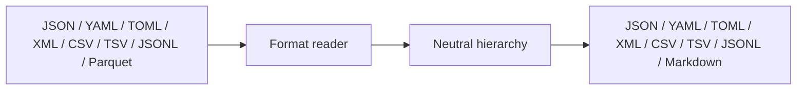
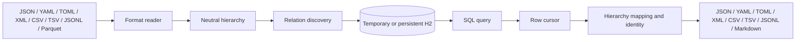
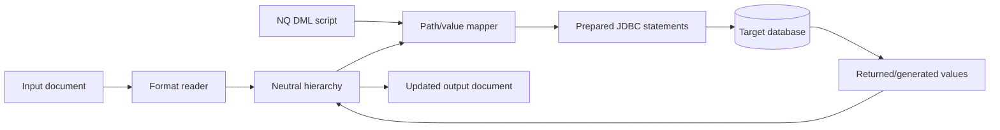

# How NQ works

NQ — SQL for nested data separates boundary formats from a neutral hierarchy,
then uses JDBC and explicit mapping paths to cross between hierarchical and
relational representations.

## Converting a document

A lone input file follows this direct path. Supplying a script instead enters
the query or mapped-DML flow; there is no automatic conversion fallback.

## Querying a document

Readers preserve a common tree of named nodes and repeated collections.
Relation discovery projects collections into H2 tables and establishes parent
keys used for joins. Named JSON/YAML collections normally use their member
names; anonymous record streams use `ITEM` unless an alias is supplied.

Queries are ordinary H2 SQL plus NQ mapping clauses. Each `into {path}` assigns
a selected value to the output hierarchy. `structure {path} key (...)` states
which SQL values identify a repeated output object. When explicit keys are
absent, NQ can infer identity from primary/unique keys, relationships, naming,
and query shape.

## Applying a document to a database

Mapped DML uses paths such as `{message.person.id}` as prepared-statement
values. Repeated hierarchy nodes can drive repeated inserts or updates.
Generated keys and returned database values can be written back into the
hierarchy before output.

## Cache modes

- **Temporary:** a query plus input file builds a fresh H2 database for that
  execution.
- **Persistent:** `--cache` or `-c` stores H2 files under `~/.nq/cache` or
  `--cache-dir`.
- **External JDBC:** query SQL runs against the configured database; an
  accompanying document supplies mapped DML values.

The [key-inference design](key-inference-design.md) documents the deeper
identity model. The [glossary](glossary.md) defines the public terminology.
